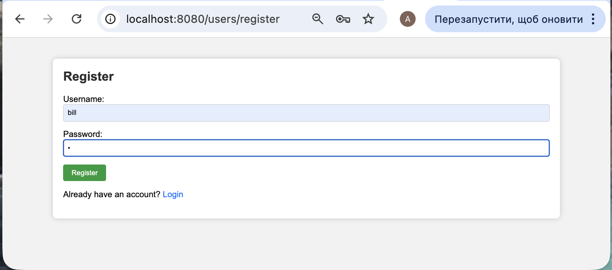
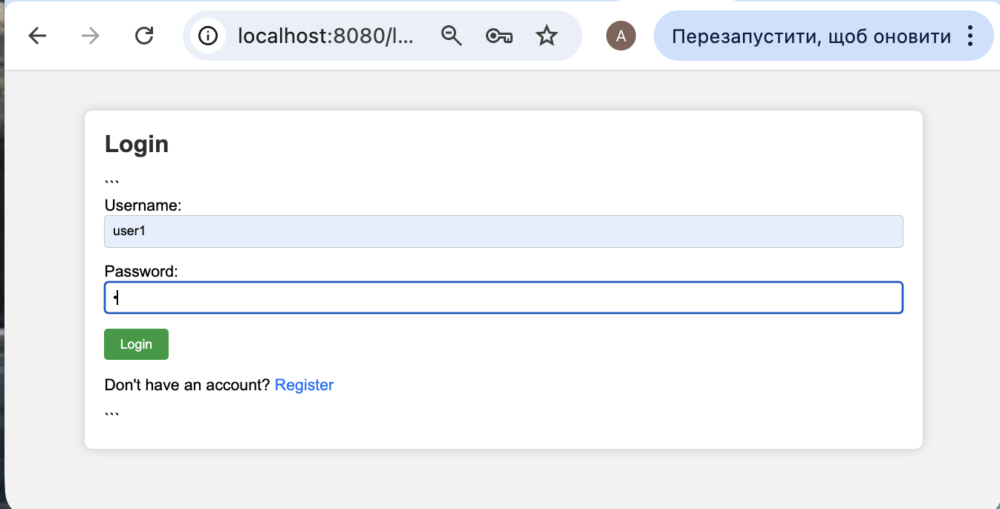
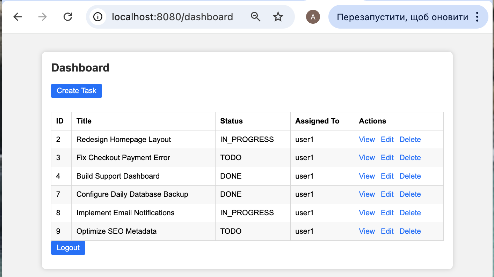
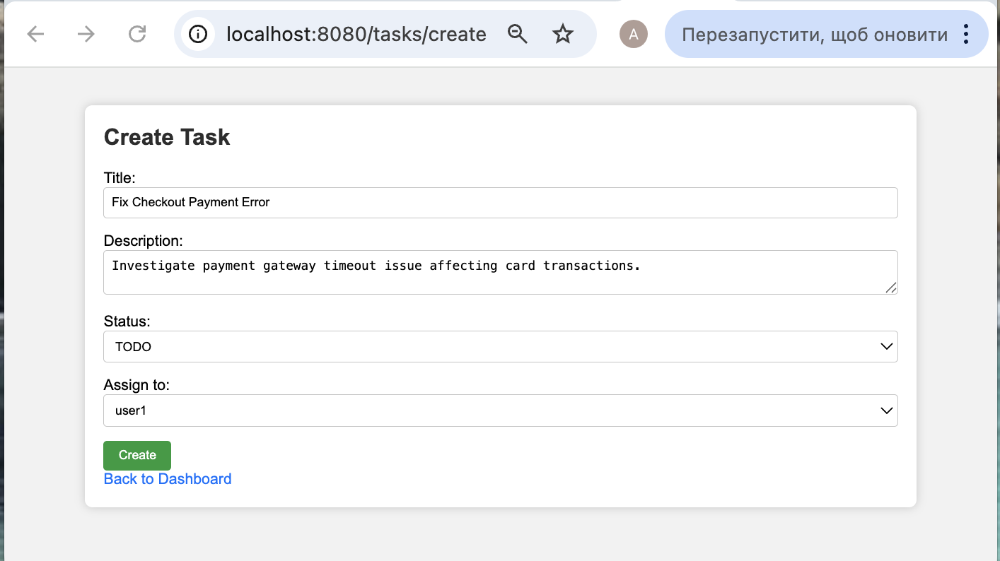
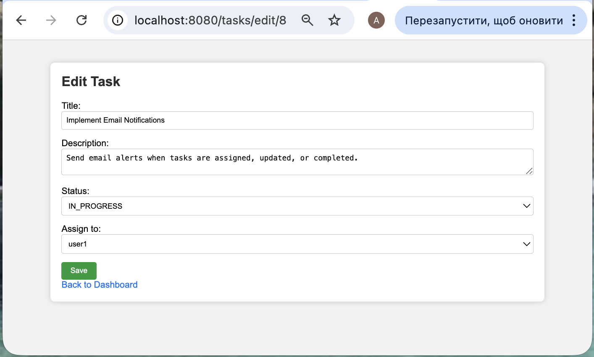
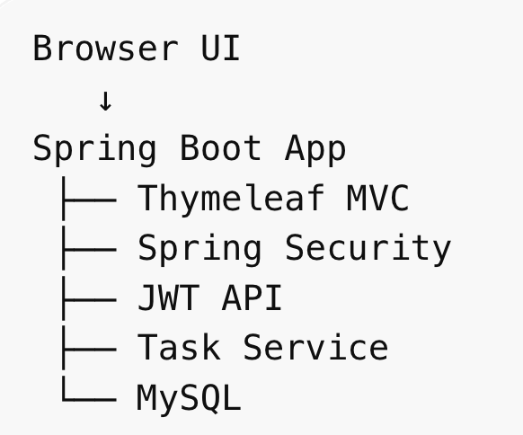

# Task Manager System

Professional task management web application built with Java Spring Boot.
Designed for teams and businesses to register users, create tasks, assign work, and track progress securely.

## 🚀 Tech Stack

Java 17 • Spring Boot • Spring Security • JWT • Thymeleaf • MySQL • REST API

---

## 📌 Key Features

✔ User Registration & Login
✔ Automatic Login After Registration
✔ Secure Authentication with Spring Security
✔ JWT-secured REST API
✔ Create / Edit / Delete Tasks
✔ Assign Tasks to Users
✔ Task Status Tracking (TODO / IN_PROGRESS / DONE)
✔ Personal Dashboard
✔ Multi-user Task Management
✔ Server-side UI with Thymeleaf

---

## 📸 UI Demo

### Registration Page



### Login Page



### Dashboard



### Create Task



### Task Details



---

## 📡 REST API

### Authentication

POST `/api/auth/login`

### Tasks

GET `/api/tasks`
POST `/api/tasks`
PUT `/api/tasks/{id}`
DELETE `/api/tasks/{id}`

JWT token can be used to access protected API endpoints.

---

## 🏗 Architecture



---

## 📊 Workflow

User Registration
↓
Login
↓
Dashboard
↓
Create Task
↓
Assign User
↓
Track Progress

---

## ⚙️ Getting Started

1. Configure MySQL database
2. Run Spring Boot application
3. Open `http://localhost:8080/users/register` to create account
4. Or open `http://localhost:8080/login`

---

## 🔐 Demo Credentials

username: `admin`
password: `password`

---

## 🌍 Environment Variables

```env
DB_USERNAME=root
DB_PASSWORD=your_password
DB_URL=jdbc:mysql://localhost:3306/task_manager
```

---

## 💡 Use Cases

* Employee task management system
* Team productivity dashboard
* Internal company workflow platform
* Secure multi-user admin panel
* Spring Boot portfolio / Fiverr showcase
